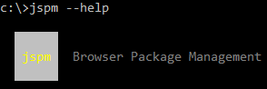

# NodeJS library import with JSPM example
Consumes [es2015-publish-template](https://github.com/setheen/es2015-publish-template) and [lodash](https://github.com/lodash/lodash) via npm and jspm

##Running this example
Make sure you have jspm installed globally first
```sh
npm install jspm -g
```
```sh
jspm install
npm install
typings install
node app.js
```

## Mechanisms utilized
- npm
    - npm registry
    - github registry
- jspm
    - npm registry
    - github registry
- typings
    - lodash
    
## Scenario
Take a look at this image

<p align="center">
    
</p>

Let it be known, jspm is meant for browsers [according to its author, Guy Bedford](https://github.com/jspm/npm/issues/36#issuecomment-143196574). 
It's meant to replace bower and npm for browser dependencies when taking advantage of the systemjs module loader.
That doesn't mean it can't or shouldn't be used with NodeJS.  The author of systemjs (same guy) even has an example on
the [systemjs github page](https://github.com/systemjs/systemjs).  

My favorite jspm feature
```json
{
    "main": "dist/cjs_es5/index.js",
    "jspm": {
        "main": "dist/es2015/index.js"
    }
}
```
That little snippet lives inside the publishing library's package.json.  It allows library authors to publish NodeJS-compatible commonjs format
over npm (as generally expected) and es6/7 modules when using systemjs without conflict.
For proof, install this example and navigate to jspm\_packages/github/setheen/. Check out the jspm-generated _"es2015-publish-template@master.js"_ file
and note the export paths:
```javascript
export * from "github:setheen/es2015-publish-template@master/dist/es2015/index.js";
export {default} from "github:setheen/es2015-publish-template@master/dist/es2015/index.js";
```
jspm accepts any kind of module format you can throw at it (umd/amd/commonjs/system/es2015) in any target version of javascript. It's touted as 
the ultimate dependency loader and worth your time to investigate.  

Unfortunately it has one giant drawback
###NO type definition support for NodeJS :(
Your IDE doesn't know to display d.ts definitions when it sees module loading code like this:
```javascript
System.import('some-package').then((p) => 
{
    // doing something with "some-package" p
});
```
This example illustrates loading es2015-publish-template and lodash module loading with npm and jspm.  Type definitions exist when loaded over
npm but not over jspm.  Even so, all four permutations will execute just fine.